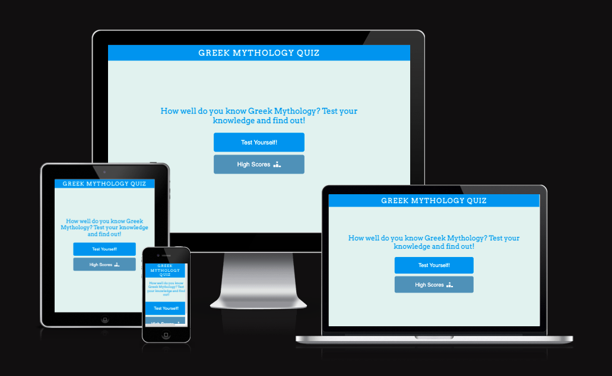

# Greek Mythology Quiz

## Overview
Greek Mythology Quiz website is an interactive site created to test the knowledge of users who are interested in Greek Mythology. It is designed to be both fun and challenging for all users regardless of their level of knowledge on Greek Mythology. It consists of 5 questions that ranges in difficulty and targets users of all ages, genders and interests. 

This quiz site is inteneded to challenge the knowledge of users who are already fascinated about Greek Mythology and hopefully to spark an interest in users who aren't as well versed in Greek Mythology. 

HTML and CSS3 technologies were used to creeate the general structure and design of the website. JavaScript technology was then used to bring website alive making it interactive for the users to use and play.

[View live website here!](https://aasanusi.github.io/greek-mythology-quiz/)

## Table of Contents
- [User Experience (UX)](#User-Experience-UX)
   - [User Stories](#User-Stories)
      - [First Time User](#First-Time-User)
      - [Returning User](#Returning-User)
      - [Consistent User](#Consistent-User)

- [Features](#Features)
   - [Existing Features](#Existing-Features)
      - [Header](#Header)
      - [Homepage](#Homepage)
      - [Quiz Page](#Quiz-Page)
      - [Endpoint](#Endpoint)
      - [Highscores Page](#Highscores-Page)
      - [Future Implementation](#Future-Implementation)

- [Design](#Design)
   - [Design Layout](#Design-Layout)
   - [Typography](#Typography)
   - [Colour Layout](#Colour-Layout)
   - [Wireframe](#Wireframe)

- [Technologies Used](#Technologies-Used)
   - [Languages Used](#Languages-Used)
   - [Frameworks, Libraries And Programs Used](#Frameworks-Libraries-And-Programs-Used)
      - [Balsamiq](#Balsamiq)
      - [Git](#Git)   
      - [Gitpod](#Gitpod)
      - [Github](#Github)
      - [Google Fonts](#Google-Fonts)
      - [Font Awesome](#Font-Awesome)
      - [ColorSpace](#ColorSpace)
      - [Google Fonts](#Google-Fonts)
      - [Favicon.cc](#Favicon.cc)

- [Testing](#Testing)
   - [Manual Testing](#Manual-Testing)
      - [Header](#Header)
      - [Test Yourself](#TestYourself!)
      - [High Scores](#High-Scores)
      - [Answers](#Answers)
      - [Save](#Save)
      - [Restart](#Restart)
      - [Home](#Home)
      - [Homepage](#Homepage)

   - [Validator Testing](#Validator-Testing)
     - [HTML](#HTML)
     - [CSS](#CSS)
     - [JavaScript](#JavaScript)
     - [Lighthouse](#Lighthouse-Testing) 

   - [Bugs Encountered And Solved](#Bugs)
    
- [Deployment](#Deployment)

- [Credits](#Credits)
   - [Media](#Media)
   - [Code](#Code)
   - [Content](#Content)
   - [Acknowledgments](#Acknowledgments)

## User Experience (UX)
- ### User Stories
  - #### First Time User
    - As a First Time User, I want to understand what the website is about from the main page.
    - As a First Time User, I want to know the subject matter of the quiz.
    - As a First Time User, I want the site to be easy to navigate in order to access the questions for the quiz.
    - As a First Time User, I want to know the amount of questions there is in the quiz.
    - As a First Time User, I want to know my progression status.
    - As a First Time User, I want to see my score in real time as I'm going through the quiz.
    - As a First Time User, I want all the buttons to direct to the correct pages it's intended to take me to.
    - As a First Time User, I want to know in real time if my answer selection are correct or incorrect.
    - As a First Time User, I want to be able to save and access my score after completing the quiz.
    - As a First Time User, I want to be able to restart the game.

   - #### Returning User
     - As a Returning User, I want to easily find my way to the quiz.
     - As a Returning User, I want to access the homepage at anytime during the quiz.
     - As a Returning User, I want to be able to save my most recent score.
     - As a Returning User, I want to be able to view and compare all my scores.

   - #### Consistent User
     - As a Consistent User, I want to able to get straight to the quiz.
     - As a Returning User, I want to access the homepage at anytime during the quiz.
     - As a Consistent User, I want to be able to access the scores table from the homepage.

## Features
Each individual feature on this quiz site was designed to make it easy for the users to navigate this site without running into any issues. This site is made up of clickable button that ranges in accessibility to either direct the users to the quiz page, home page, the highscore page and actually answering the questions asked on the quiz page.

- ### Existing Features
  - ### Header
    - This consists of the heading of the page which provides details on that the site is. This heading lets the user know that this is a Greek Mythology Quiz site.
    - The header was also created to be able to be clicked at anytime and will direct user back to the homepage. This was to provide the user the option to be able to go to the homepage at any given time during the game or after.

  - ### Homepage
    - The homepage has a well balanced colour structure from the header, the messages and the buttons. The colours on the homepage is consistent across the site.
    - The homepage consists of welcoming messgae that informs the user about the page and urges the user to challenge their knowledge on Greek Mythology.
    - The homepage also consists of two clickable buttons: Test Yourself! and High Scores button. Both buttons has hover to ensure the user knows which button they are about to click. Both buttons increase in size and highlighed with a shadow of their respective colour when hovered over.
    - The "Test Yourself!" button takes the user to the quiz page.
    - The "High Scores" button takes the user to the Highscore page. 

  

  - ### Quiz Page
      - This consists of the heading of the page which provides details on that the site is. This heading lets the user know that this is a Greek Mythology Quiz site.

  

  - ### Endpoint
      - This consists of the heading of the page which provides details on that the site is. This heading lets the user know that this is a Greek Mythology Quiz site.

  

  - ### Highscores Page
      - This consists of the heading of the page which provides details on that the site is. This heading lets the user know that this is a Greek Mythology Quiz site.

  

  - ### Future Implementation

