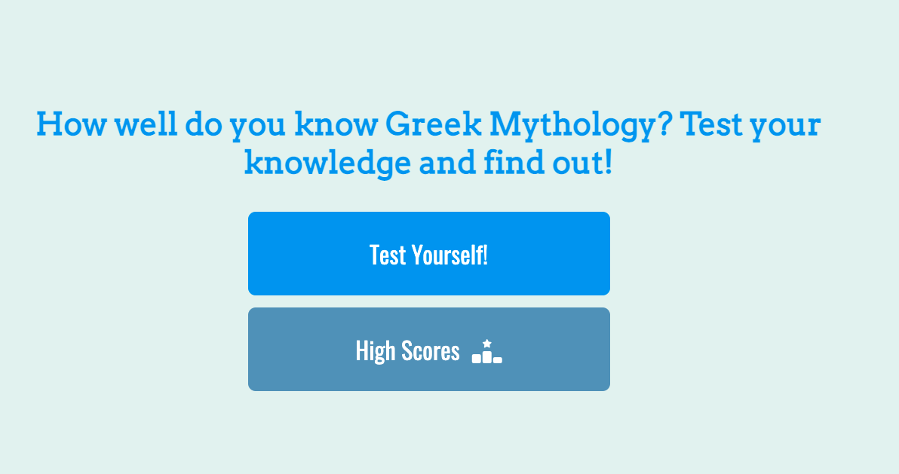
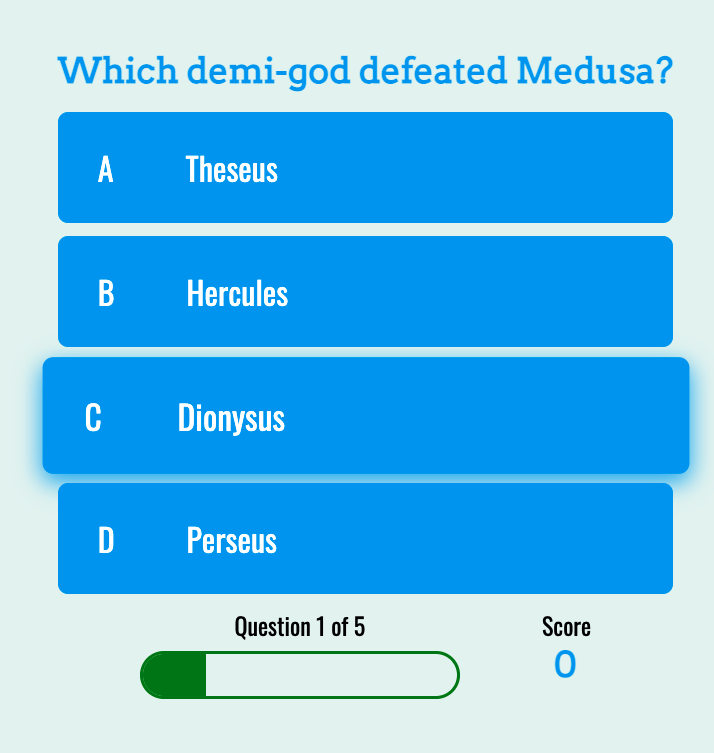
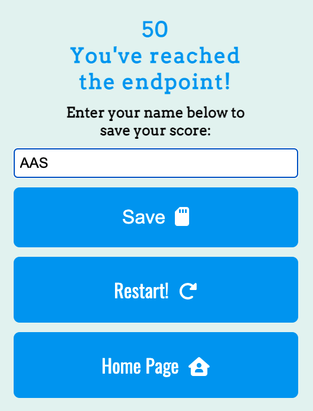
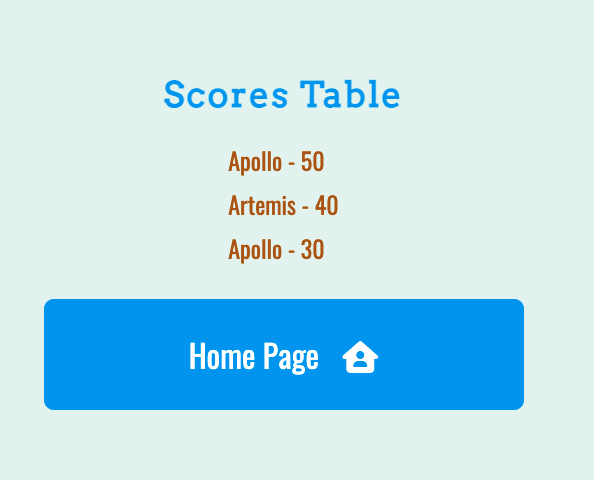
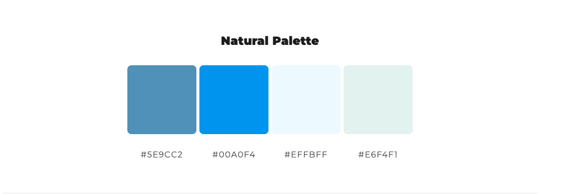
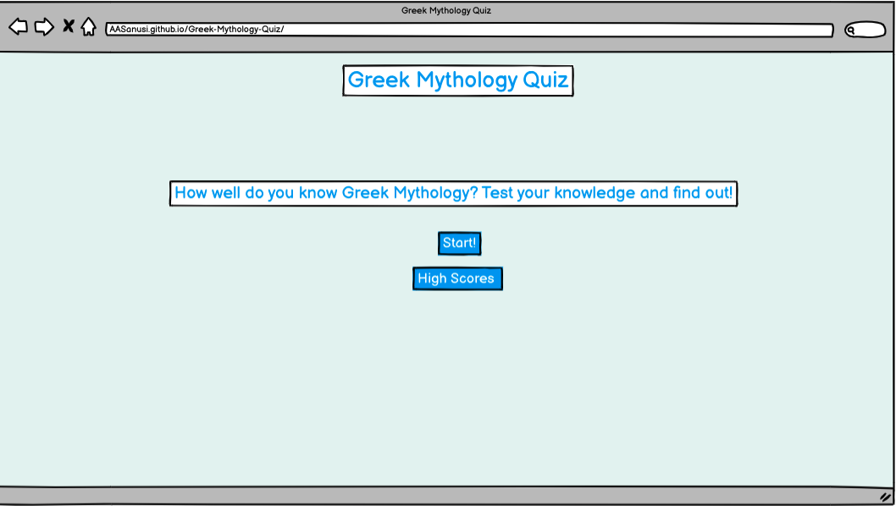
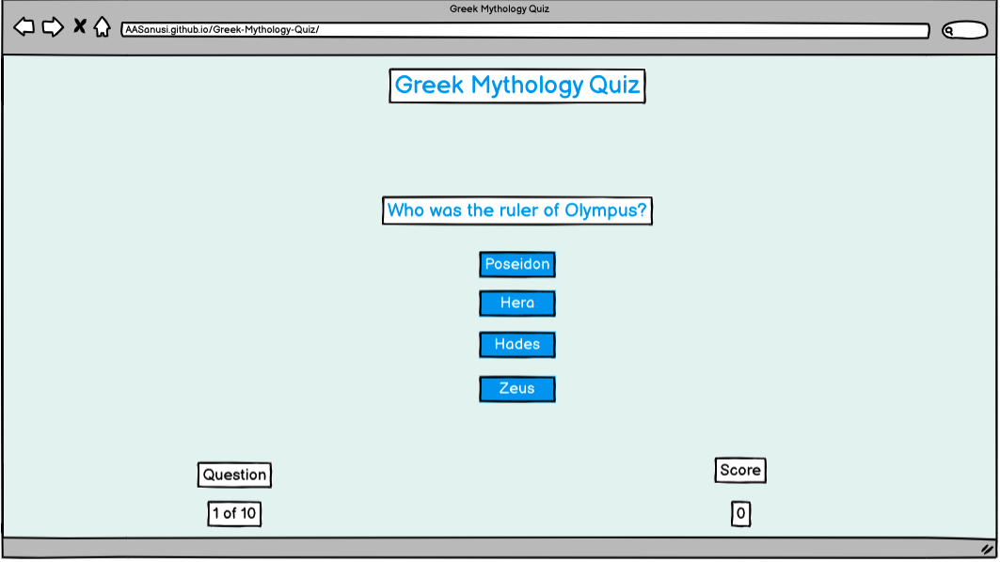
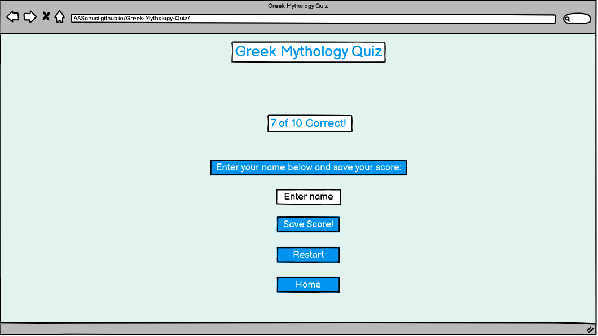
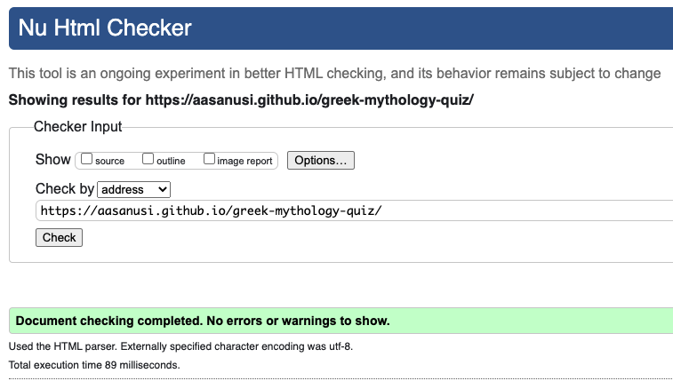
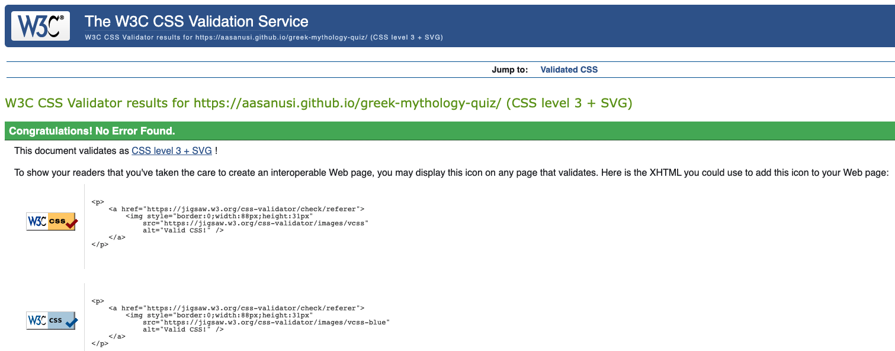

# Greek Mythology Quiz

## Overview
Greek Mythology Quiz website is an interactive site created to test the knowledge of users who are interested in Greek Mythology. It is designed to be both fun and challenging for all users regardless of their level of knowledge on Greek Mythology. It consists of 5 questions that ranges in difficulty and targets users of all ages, genders and interests. 

This quiz site is inteneded to challenge the knowledge of users who are already fascinated about Greek Mythology and hopefully to spark an interest in users who aren't as well versed in Greek Mythology. 

HTML and CSS3 technologies were used to creeate the general structure and design of the website. JavaScript technology was then used to bring website alive making it interactive for the users to use and play.

[View live website here!](https://aasanusi.github.io/greek-mythology-quiz/)

## Table of Contents
- [User Experience (UX)](#User-Experience-UX)
   - [User Stories](#User-Stories)
      - [First Time User](#First-Time-User)
      - [Returning User](#Returning-User)
      - [Consistent User](#Consistent-User)

- [Features](#Features)
   - [Existing Features](#Existing-Features)
      - [Header](#Header)
      - [Home Page](#Home-Page)
      - [Quiz Page](#Quiz-Page)
      - [Endpoint Page](#Endpoint-Page)
      - [Highscores Page](#Highscores-Page)
      - [Future Implementation](#Future-Implementation)

- [Design](#Design)
   - [Typography](#Typography)
   - [Colour Layout](#Colour-Layout)
   - [Balsamiq Wireframe](#Balsamiq-Wireframe)

- [Technologies Used](#Technologies-Used)
   - [Languages Used](#Languages-Used)
   - [Frameworks, Libraries And Programs Used](#Frameworks-Libraries-And-Programs-Used)
      - [Balsamiq](#Balsamiq)
      - [Git](#Git)   
      - [Gitpod](#Gitpod)
      - [Github](#Github)
      - [Google Fonts](#Google-Fonts)
      - [Font Awesome](#Font-Awesome)
      - [ColorSpace](#ColorSpace)
      - [Favicon.cc](#Favicon.cc)

- [Testing](#Testing)
   - [Manual Testing](#Manual-Testing)
      - [Header](#Header)
      - [Test Yourself!](#TestYourself!)
      - [High Scores](#High-Scores)
      - [Answers](#Answers)
      - [Save](#Save)
      - [Restart!](#Restart!)
      - [Homepage](#Homepage)

   - [Validator Testing](#Validator-Testing)
     - [HTML](#HTML)
     - [CSS](#CSS)
     - [JavaScript](#JavaScript)
     - [Lighthouse](#Lighthouse-Testing) 

   - [Bugs Encountered And Solution](#Bugs-Encountered-And-Solution)
    
- [Deployment](#Deployment)

- [Credits](#Credits)
   - [Media](#Media)
   - [Code](#Code)
   - [Content](#Content)
   - [Acknowledgments](#Acknowledgments)

## User Experience (UX)
- ### User Stories
  - #### First Time User
    - As a First Time User, I want to understand what the website is about from the main page.
    - As a First Time User, I want to know the subject matter of the quiz.
    - As a First Time User, I want the site to be easy to navigate in order to access the questions for the quiz.
    - As a First Time User, I want to know the amount of questions there is in the quiz.
    - As a First Time User, I want to know my progression status.
    - As a First Time User, I want to see my score in real time as I'm going through the quiz.
    - As a First Time User, I want all the buttons to direct to the correct pages it's intended to take me to.
    - As a First Time User, I want to know in real time if my answer selection are correct or incorrect.
    - As a First Time User, I want to be able to save and access my score after completing the quiz.
    - As a First Time User, I want to be able to restart the game.

   - #### Returning User
     - As a Returning User, I want to easily find my way to the quiz.
     - As a Returning User, I want to access the homepage at anytime during the quiz.
     - As a Returning User, I want to be able to save my most recent score.
     - As a Returning User, I want to be able to view and compare all my scores.

   - #### Consistent User
     - As a Consistent User, I want to able to get straight to the quiz.
     - As a Returning User, I want to access the homepage at anytime during the quiz.
     - As a Consistent User, I want to be able to access the scores table from the homepage.

## Features
Each individual feature on this quiz site was designed to make it easy for the users to navigate this site without running into any issues. This site is made up of clickable button that ranges in accessibility to either direct the users to the quiz page, home page, the highscore page and actually answering the questions asked on the quiz page.

- ### Existing Features
  - #### Header
    - This consists of the heading of the page which provides details on that the site is. This heading lets the user know that this is a Greek Mythology Quiz site.
    - The header was also created to be able to be clicked at anytime and will direct user back to the home page. This was to provide the user the option to be able to go to the homepage at any given time during the game or after.

  - #### Home Page
    - The home page has a well balanced colour structure from the header, the messages and the buttons. The colours on the homepage is consistent across the site.
    - The home page consists of welcoming messgae that informs the user about the page and urges the user to challenge their knowledge on Greek Mythology.
    - The home page also consists of two clickable buttons: Test Yourself! and High Scores button. Both buttons has hover to ensure the user knows which button they are about to click. Both buttons increase in size and highlighed with a shadow of their respective colour when hovered over.
    - The "Test Yourself!" button takes the user to the quiz page.
    - The "High Scores" button takes the user to the Highscore page. 

  

  - #### Quiz Page
    - The quiz page follows the same colour scheme and aesthics as the home page.
    - The quiz page consists of the question which is captuted in blue writing and the four answer choices buttons in blue with white writing.
    - Each answer buttons increases in size and highlights with a shadow of their respective colour when hovered over.
    - When user clicks one of the button, it will either turn "red" meaning incorrect answer or turn "green" which means answer selected was correct. After each selection incorrect or correct, the page moves on to the next question until reaching the endpoint.
    - At the bottom the quiz page, there's a display text for amount of questions completed out of the overall questions, progression bar and a scoring meter. 

  

  - #### Endpoint Page
      - After completing all questions, user directed to the endpoint page of the quiz. Endpoint is aesthically similar to the other pages.
      - The endpoint page shows the user's score at the top with a message belwo informing the user they've reached the end of the game.
      - Below the score and endpoint message is another messgae that informs the user to input their name in the box provided to save their scores. The box has a placeholder to prompt the user to enter their name in the box.
      - Below the input box, there are 3 buttons: "Save" button, "Restart!" button and "Home Page" button. The "Save" button allows the users to save their details and scores which directs them to the High Score page once clicked. "Restart!" button allows user to start quiz over."Home Page" when clicked on will take the user back to the home page.

  

  - #### Highscores Page
      - The highscores page consists of the scores table heading to inform the user of the leaderboard table.
      - The scores tables updates automatically when user save their scores. This will show users name alongside with the score.

  

- ### Future Implementation
  - #### Additional questions
      - To add more questions to the quiz to really challenge the users knowledge. This will also increase the time spent on the quiz providing a more worthy user experience.

  - #### Sharing scores
      - Provide a button to be able to share scores to social media. This will allow users to boast about their scores online.
      - Doing this will also bring traction to the site as it will pique the interest of people online.

## Design
  - ### Typography 
      - The Arvo family font is the main font used for the header, questions and all headings across the page. This font gives a Greek aesthic feeling to the elements it was applied on.
      - Oswald family is the secondary font that was used for the rest of the elements that appeared in the body of the site. Oswald font complemented the Arvo font to give a nice consistent aesthic structure to the page.
      - Sans serif used as the fallback font in case the Arvo family font doesn't load in some browsers. San serif is the standard font to use as a fallback.

  - ### Colour Layout
      - The colour idea came from the website [ColorSpace](https://mycolor.space/), this genrates complementary colours to use on the site.
      - The colour layout of this site consists of three main colours which are white, blue and light pastel green. The white colour used for the text inside the buttons and header text. The blue to encapsulate the header text, the buttons text, questions, scores text at the bottom of the quiz page and the end point text. The light pastel green was used as the overall background colour of the site. 
      - There are other colours that features on the site: black for the display progression question text, the actual score text and the message to inform the user to enter details. There's also a brown-reddish colour used for the score details on the highscore page.    

  - ### Balsamiq Wireframe
      - Balsamiq wireframe used to create the basic and initial frameworks of the website layout. This was later developed even further when coding.

## Technologies Used

### Languages Used

- [HTML5](https://en.wikipedia.org/wiki/HTML5)
- [CSS3](https://en.wikipedia.org/wiki/CSS)
- [JavaScript](https://en.wikipedia.org/wiki/JavaScript)

### Frameworks, Libraries And Programs Used

1. #### [Balsamiq:](https://balsamiq.com/)
    - Balsamiq wireframe used to create the basic and initial frameworks of the project to aid the development of the website.
2. #### [Git:](https://git-scm.com/)
   - Git was used in the Gitpod terminal to add, commit and push code to Github.
3. #### [Gitpod:](https://www.gitpod.io/)
   - Gitpod is the Integrated Developer Environment used to code this project.
4. #### [Github:](https://github.com/)
   - Github was used to hold and keep the pushed codes by Git and store projects.
5. #### [Google Fonts:](https://fonts.google.com/)
   - Google fonts was used to import "Arvo" and "Oswald" fonts into CSS and used across the website.
6. #### [Font Awesome:](https://fontawesome.com/)
   - Font Awesome was used to create the icons that can be found on some of the buttons.
7. #### [ColorSpace:](https://mycolor.space/)
   - ColorSpace generated complimentary colours to form the colour layout of the website.
8. #### [Favicon.cc:](https://www.favicon.cc/)
   - Favicon.cc was used to generate the favourite icon for the tab of the website.

## Testing

  - ### Manual Testing
    - Manual editing was carried on each button and functionality to ensure a smooth running of the quiz. Header links opens to the home page correctly. The buttons all work and open corectly. The answers buttons show incorrect and correct answers. The save button save user details correctly to the high scores page.

 - ### Validator Testing
    - #### HTML
       - No errors were returned when passing through the official [W3C validator](https://validator.w3.org/nu/)
       

    - #### CSS
       - No errors were returned when passing through the official [(Jigsaw) validator](https://jigsaw.w3.org/css-validator/)
       

    - #### JavaScript 
       - 

    - #### Lighthouse Testing
       - Performance score

 ### Bugs Encountered And Solution:
   - #### Bugs   
       - The answers selection buttons were showing undefined instead of the answer choices.
   - #### Solution   
       - Used 97 to represent the letter "a" to gain access to the currentQuestion.a. Converted 97 + i to a letter. And on the second loop "i" will equal to one, therefore, 97 + i = 98 which will represent the letter "b".

### Unfixed Bugs
All bugs were fixed before the submission of this project.

## Deployment

### Using Github Pages to deploy project
  - Log into your github.
  - Go to your profile to find your repositories and choose the relevant repository.
  - On the project repository page, click the settings tab.
  - Direct your attention to the left hand side tab and scroll down to find the "Pages" option and click it.
  - On the "Github Pages" page, scroll down and under source change dropdown to "main' and click save.
  - Pop up box appears with a message and a link of your site about to be deployed.
  - Give it a few minutes then refresh the page to deploy your site and a message saying "Your site is published at https://aasanusi.github.io/greek-mythology-quiz/".

### How to Fork a repository
  - Log into your github.
  - Proceed to the relevant repository.
  - Direct your attenttion to the top right corner of the repository page and locate the "Fork" button.
  - Click the "Fork" button.

### How to Clone a repository
  - Log into your github.
  - Access the main page of the relevant repository.
  - Below the settings tab, find and click the green "code" button.
  - Pop up box appears with a URL to which you copy this URL for the repository. There are options to clone the repositiory using HTTPS, SSH key and Github CLI. Choose the relevant one for you, in this case woould be HTTPS tab.
  - Click the clipboard beside the URL to open the terminal.
  - Change the current directory to the location where you want the cloned directory.
  - Insert "git clone" with the URL you copied above.
  - Click "Enter" and local clone will be created.

## Credits

### Media
  - No photos were use for this project has most of the website consists of buttons for the quiz.

### Code
  - [Code Institute](https://codeinstitute.net/) provides template for boilerplate codes.
  - [W3Schools](https://www.w3schools.com/) aided in forming the basic HTML and CSS code.
  - [Kinsta](https://kinsta.com/) aided in forming the media queries for this site.
  - [Simple Steps Code](https://simplestepscode.com/javascript-quiz-tutorial/) helped with forming JavaScrip quiz. Tutorial was used to form some parts of my Javascript structure codes in this project.
  - [Brian Design Youtube Tuorial](https://www.youtube.com/watch?v=f4fB9Xg2JEY) aided in forming parts of HTML, CSS and JavaScript code and to which was added to mine.

### Content
  - All headings and questions were written by the developer.
  - README created by following IDE and Deployment essential video.
  - Header structure was created by following Love Running walkthrough video.

### Acknowledgement 
  - #### Fellow Classmates
       - I would like to thank Jared for always providing me with advice on how to go about the project.
       - I would like to thank Suzanne for providing resources to help out with my project.
       - I would like to thank Frankie for providing the instructions and resource on how to create a Favicon.

  - #### Tutor
       - I would like to thank Sean for helping me out with forming the options for the answers in my quiz.
       - I would like to thank Scott for helping me to structure the quiz.

  - #### Mentor
       - I would like to thank my mentor for providing me with the initial idea for the project and providing me resources that helped me build my project.
       - I would like to thank my mentor for the continuous help and feedback on my project.

     

